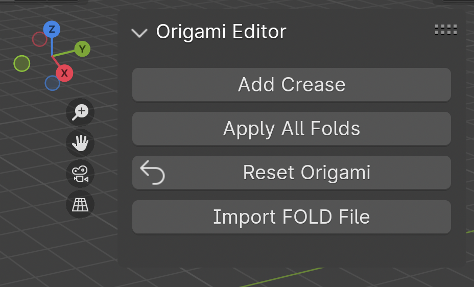

# Origami Blender Addon

A Blender addon for simulating and editing origami structures using geometric constraints and folding operations.

## Installation

### Install from ZIP (Recommended)

1. Download the repository as a `.zip`
2. Open Blender
3. Go to:

   `Edit → Preferences → Add-ons`

4. Click **Install...**
5. Select the `.zip` file
6. Enable the addon (search for "Origami")

## Use

1. Import a FOLD file or create the crease pattern manually.
2. Select the object and Go to Edit mode
3. Click **Apply All Folds**

## For developers

### Folder structure

* [core/](core/): Simulation engine
    * [constraints.py](constraints.py)
    * [crease.py](crease.py)
    * [crease_manager.py](crease_manager.py)
    * [edge_utils.py](edge_utils.py)
    * [fold_engine.py](fold_engine.py)
    * [utils.py](utils.py)
* [operators/](operators/)  
    * [add_crease.py](add_crease.py)      
    * [apply_folds.py](apply_folds.py)
    * [import_fold.py](import_fold.py)
    * [reset_op.py](reset_op.py)
* [properties/]()      
    * [crease_props.py](crease_props.py)       
* [tests/](tests/)
    * [tools/](tools/) 
        * [run_blender_test.py](run_blender_test.py)             
    * [framework.py](framework.py)
    * [run_test.py](run_test.py)
    * [test_core.py](test_core.py)
* [ui/](ui/)
    * [panel.py](panel.py)
